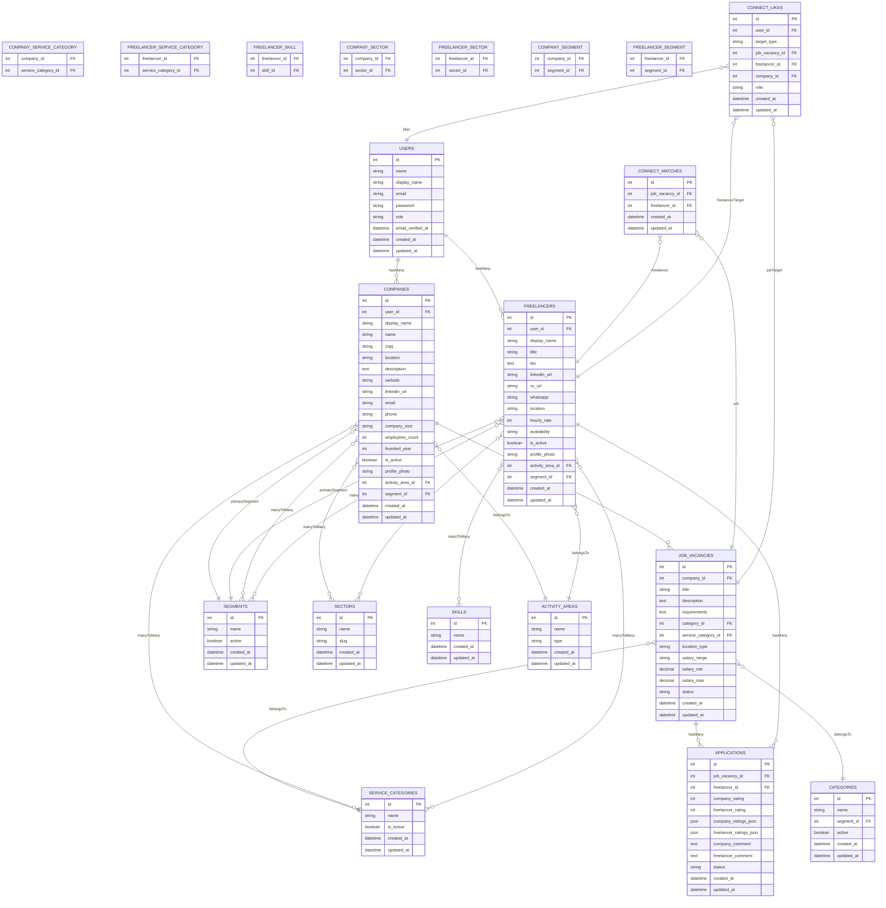
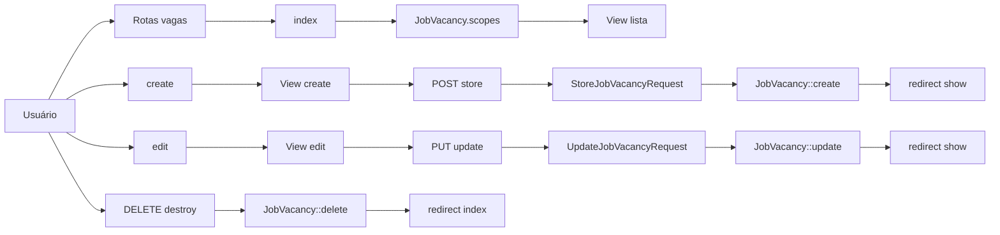
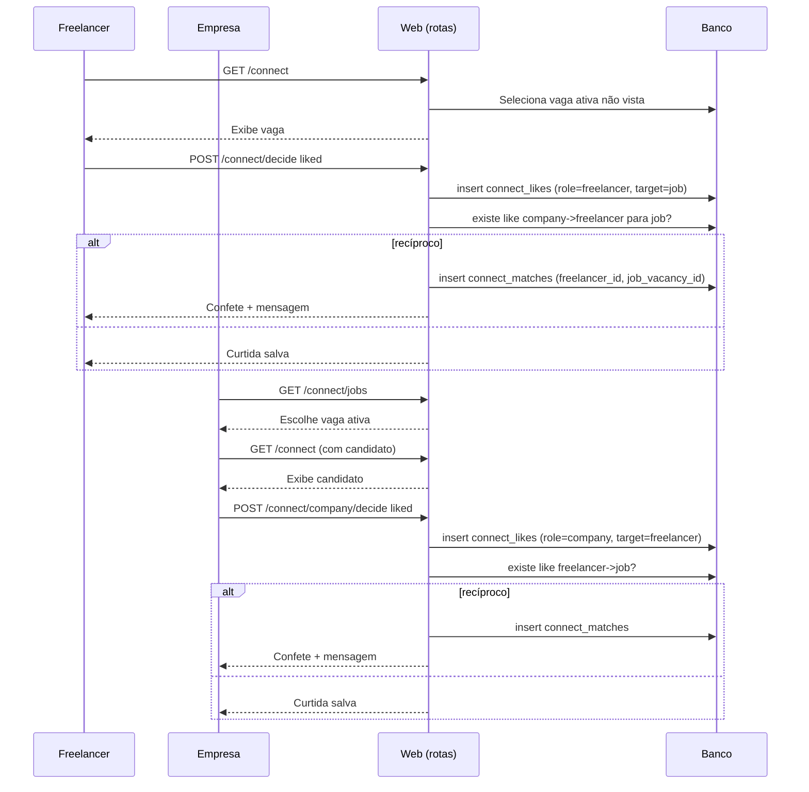

# Diagramas do Sistema

## Diagrama Entidade-Relacionamento (ER)

```mermaid
erDiagram
  USERS {
    int id PK
    string name
    string display_name
    string email
    string password
    string role
    datetime email_verified_at
    datetime created_at
    datetime updated_at
  }

  COMPANIES {
    int id PK
    int user_id FK
    string display_name
    string name
    string cnpj
    string location
    text description
    string website
    string linkedin_url
    string email
    string phone
    string company_size
    int employees_count
    int founded_year
    boolean is_active
    string profile_photo
    int activity_area_id FK
    int segment_id FK
    datetime created_at
    datetime updated_at
  }

  FREELANCERS {
    int id PK
    int user_id FK
    string display_name
    string title
    text bio
    string linkedin_url
    string cv_url
    string whatsapp
    string location
    int hourly_rate
    string availability
    boolean is_active
    string profile_photo
    int activity_area_id FK
    int segment_id FK
    datetime created_at
    datetime updated_at
  }

  JOB_VACANCIES {
    int id PK
    int company_id FK
    string title
    text description
    text requirements
    int category_id FK
    int service_category_id FK
    string location_type
    string salary_range
    decimal salary_min
    decimal salary_max
    string status
    datetime created_at
    datetime updated_at
  }

  APPLICATIONS {
    int id PK
    int job_vacancy_id FK
    int freelancer_id FK
    int company_rating
    int freelancer_rating
    json company_ratings_json
    json freelancer_ratings_json
    text company_comment
    text freelancer_comment
    string status
    datetime created_at
    datetime updated_at
  }

  CATEGORIES {
    int id PK
    string name
    int segment_id FK
    boolean active
    datetime created_at
    datetime updated_at
  }

  SEGMENTS {
    int id PK
    string name
    boolean active
    datetime created_at
    datetime updated_at
  }

  SECTORS {
    int id PK
    string name
    string slug
    datetime created_at
    datetime updated_at
  }

  SERVICE_CATEGORIES {
    int id PK
    string name
    boolean is_active
    datetime created_at
    datetime updated_at
  }

  SKILLS {
    int id PK
    string name
    datetime created_at
    datetime updated_at
  }

  ACTIVITY_AREAS {
    int id PK
    string name
    string type
    datetime created_at
    datetime updated_at
  }

  COMPANY_SERVICE_CATEGORY {
    int company_id FK
    int service_category_id FK
  }

  FREELANCER_SERVICE_CATEGORY {
    int freelancer_id FK
    int service_category_id FK
  }

  FREELANCER_SKILL {
    int freelancer_id FK
    int skill_id FK
  }

  COMPANY_SECTOR {
    int company_id FK
    int sector_id FK
  }

  FREELANCER_SECTOR {
    int freelancer_id FK
    int sector_id FK
  }

  COMPANY_SEGMENT {
    int company_id FK
    int segment_id FK
  }

  FREELANCER_SEGMENT {
    int freelancer_id FK
    int segment_id FK
  }

  CONNECT_LIKES {
    int id PK
    int user_id FK
    string target_type
    int job_vacancy_id FK
    int freelancer_id FK
    int company_id FK
    string role
    datetime created_at
    datetime updated_at
  }

  CONNECT_MATCHES {
    int id PK
    int job_vacancy_id FK
    int freelancer_id FK
    datetime created_at
    datetime updated_at
  }

  USERS ||--o{ COMPANIES : hasMany
  USERS ||--o{ FREELANCERS : hasMany

  COMPANIES ||--o{ JOB_VACANCIES : hasMany
  JOB_VACANCIES ||--o{ APPLICATIONS : hasMany
  FREELANCERS ||--o{ APPLICATIONS : hasMany

  JOB_VACANCIES }o--|| CATEGORIES : belongsTo
  JOB_VACANCIES }o--|| SERVICE_CATEGORIES : belongsTo

  COMPANIES }o--|| ACTIVITY_AREAS : belongsTo
  FREELANCERS }o--|| ACTIVITY_AREAS : belongsTo

  COMPANIES }o--|| SEGMENTS : primarySegment
  FREELANCERS }o--|| SEGMENTS : primarySegment

  COMPANIES }o--o{ SERVICE_CATEGORIES : manyToMany
  FREELANCERS }o--o{ SERVICE_CATEGORIES : manyToMany

  FREELANCERS }o--o{ SKILLS : manyToMany

  COMPANIES }o--o{ SECTORS : manyToMany
  FREELANCERS }o--o{ SECTORS : manyToMany

  COMPANIES }o--o{ SEGMENTS : manyToMany
  FREELANCERS }o--o{ SEGMENTS : manyToMany

  CONNECT_MATCHES }o--|| JOB_VACANCIES : job
  CONNECT_MATCHES }o--|| FREELANCERS : freelancer

  CONNECT_LIKES }o--|| USERS : liker
  CONNECT_LIKES }o--|| JOB_VACANCIES : jobTarget
  CONNECT_LIKES }o--|| FREELANCERS : freelancerTarget
```

## Fluxo CRUD de Vagas

```mermaid
flowchart LR
  A[Usuário] --> B[Rotas vagas]
  B --> C[index]
  C --> D[JobVacancy.scopes]
  D --> E[View lista]

  A --> F[create]
  F --> G[View create]
  G --> H[POST store]
  H --> I[StoreJobVacancyRequest]
  I --> J[JobVacancy::create]
  J --> K[redirect show]

  A --> L[edit]
  L --> M[View edit]
  M --> N[PUT update]
  N --> O[UpdateJobVacancyRequest]
  O --> P[JobVacancy::update]
  P --> Q[redirect show]

  A --> R[DELETE destroy]
  R --> S[JobVacancy::delete]
  S --> T[redirect index]
```

## Fluxo de Matchmaking

```mermaid
sequenceDiagram
  participant F as Freelancer
  participant C as Empresa
  participant W as Web (rotas)
  participant DB as Banco

  F->>W: GET /connect
  W->>DB: Seleciona vaga ativa não vista
  W-->>F: Exibe vaga

  F->>W: POST /connect/decide liked
  W->>DB: insert connect_likes (role=freelancer, target=job)
  W->>DB: existe like company->freelancer para job?
  alt recíproco
    W->>DB: insert connect_matches (freelancer_id, job_vacancy_id)
    W-->>F: Confete + mensagem
  else
    W-->>F: Curtida salva
  end

  C->>W: GET /connect/jobs
  W-->>C: Escolhe vaga ativa
  C->>W: GET /connect (com candidato)
  W-->>C: Exibe candidato

  C->>W: POST /connect/company/decide liked
  W->>DB: insert connect_likes (role=company, target=freelancer)
  W->>DB: existe like freelancer->job?
  alt recíproco
    W->>DB: insert connect_matches
    W-->>C: Confete + mensagem
  else
    W-->>C: Curtida salva
  end
```